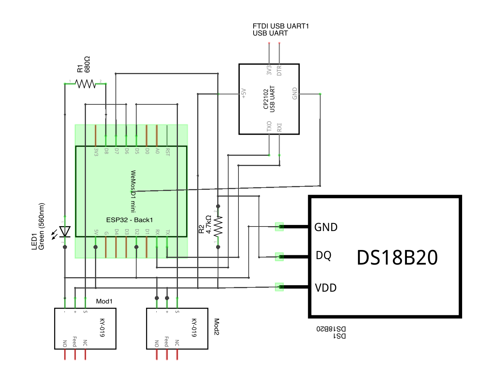
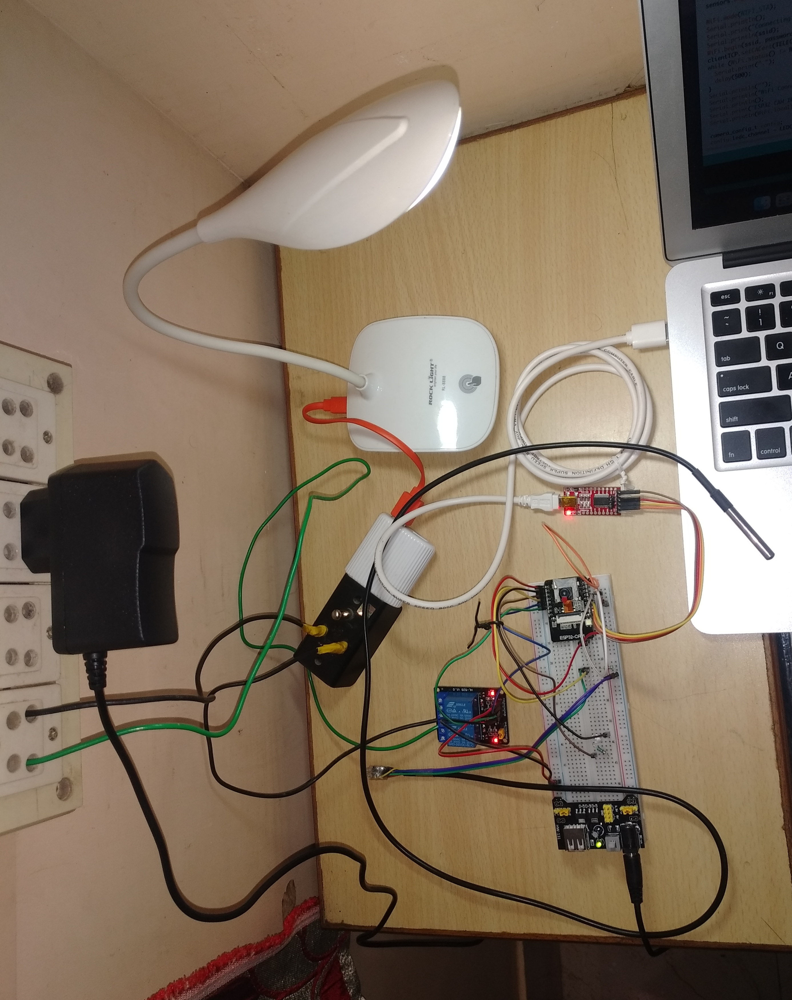
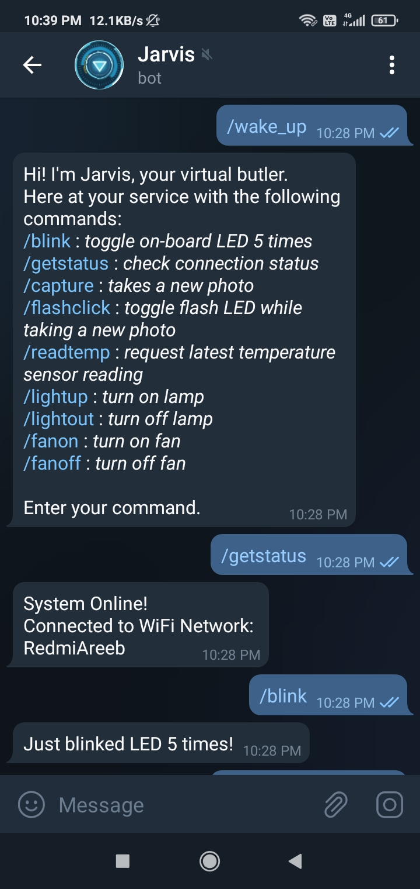
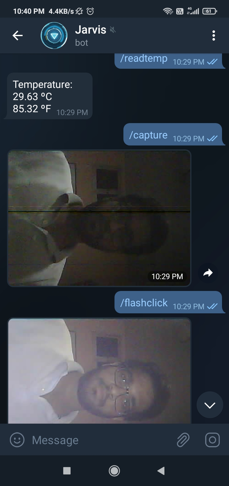
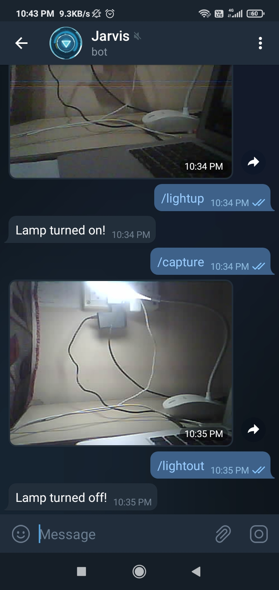
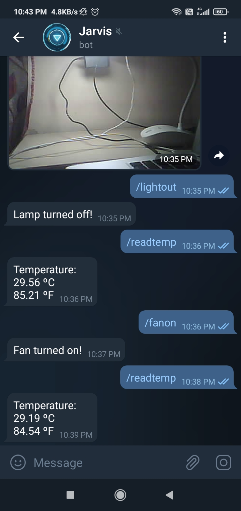

# Home Automation via Telegram

### Introduction
This project uses an __esp32-cam__ developer board to build a system that allows the user to control electric devices, request a photo, control flash-LED and get temperature readings via WiFi, interfaced through a __telegram bot__ API. 
Further modifications can be added to include _PIR Sensor_ triggered photo capture, _LDR_ controlled lighting, staircase switching for manual over-ride and many more such features. 
### Components
* ESP32-CAM Development Board
* FTDI Serial Adapter Module (USB to TTL)
* DS18B20 Temperature Sensor
* 5V Relay Module 
* Power Supply Module
* 12V DC Adapter
* LED & Resistors (1k & 4.7k ohm)
* Breadboard & Jumper Wires

### Circuit Diagram & Setup
<table style="margin: 0 auto;">
  <tr>
    <td>
        
        
 Circuit Schematic Diagram  

    </td>
    <td style="font-size: 32px; text-align: center; vertical-align: middle;">&rarr;</td>
    <td>
        
        
 Actual Setup 

    </td>
  </tr>
</table>

### Telegram Integration
<table style="margin: 0 auto;">
  <tr>
    <td></td>
    <td></td>
    <td></td>
    <td></td>
  </tr>
  </table>